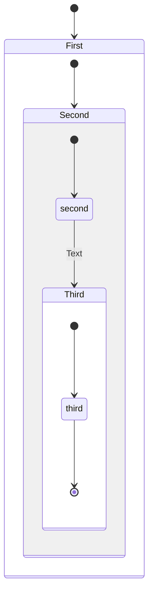

# parser-procedural

A procedural approach to using parser to process a JSON string.

```mermaid
stateDiagram-v2
    [*] --> First

    state First {
        [*] --> Second

        state Second {
            [*] --> second
            second --> Third: Text

            state Third {
                [*] --> third
                third --> [*]
            }
        }
    }
```
